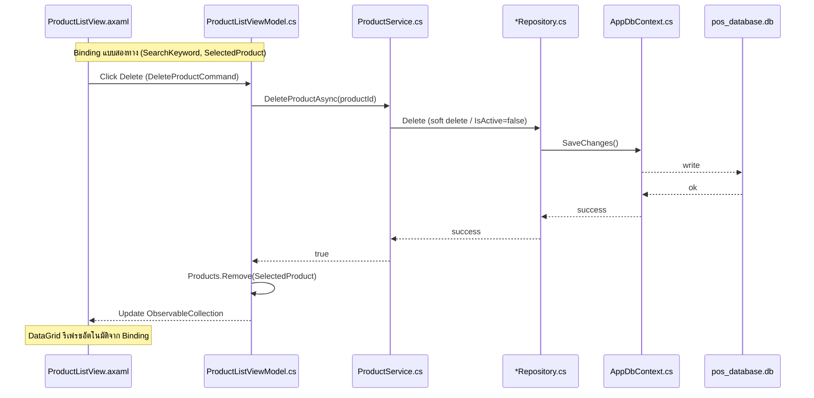
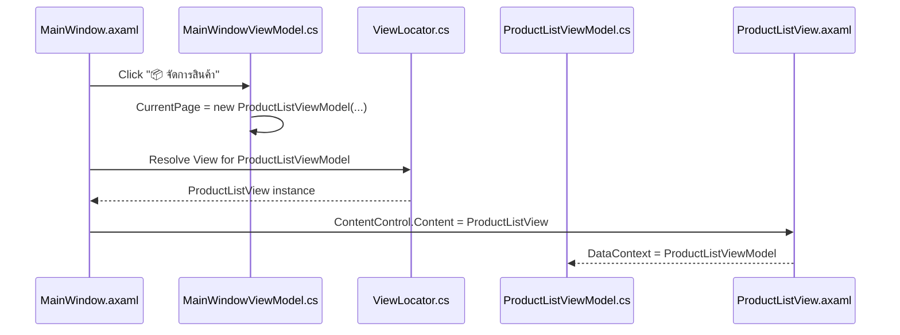

# 💪 **ทำได้แน่นอน!** ระบบซับซ้อนหลายหน้าด้วย C# + AvaloniaUI

มาดูตัวอย่างระบบที่ **ซับซ้อนจริง** กันเลย!

---

## 🏢 **ตัวอย่าง: ระบบจัดการร้านค้า (POS System)**

### ฟีเจอร์ที่มี:
- 🔐 **Login/Authentication**
- 📦 **Product Management** (CRUD)
- 🛒 **Sales & Checkout**
- 📊 **Dashboard & Reports**
- 👥 **Employee Management**
- 💾 **Database (SQLite/PostgreSQL)**
- 🖨️ **Print Receipt**
- 📈 **Real-time Charts**

---

## 📁 **โครงสร้างโปรเจคแบบซับซ้อน**

```
MyPOSSystem/
│
├── 📁 Assets/                          # ไฟล์ทรัพยากร
│   ├── 📁 Fonts/                       # ฟอนต์
│   │   ├── Inter-Regular.ttf
│   │   └── Inter-Bold.ttf
│   ├── 📁 Images/                      # รูปภาพ, ไอคอน
│   │   ├── logo.png
│   │   └── product-placeholder.png
│   └── 📁 Icons/                       # SVG icons
│
├── 📁 Models/                          # Data Models (โครงสร้างข้อมูล)
│   ├── User.cs                         # ข้อมูลผู้ใช้
│   ├── Product.cs                      # ข้อมูลสินค้า
│   ├── Sale.cs                         # ข้อมูลการขาย
│   ├── SaleItem.cs                     # รายการสินค้าในบิล
│   ├── Employee.cs                     # ข้อมูลพนักงาน
│   ├── Category.cs                     # หมวดหมู่สินค้า
│   └── Report.cs                       # ข้อมูลรายงาน
│
├── 📁 ViewModels/                      # Business Logic
│   ├── ViewModelBase.cs                # Base class
│   ├── MainWindowViewModel.cs          # ViewModel หลัก
│   │
│   ├── 📁 Auth/                        # Authentication
│   │   ├── LoginViewModel.cs           # Login logic
│   │   └── RegisterViewModel.cs        # Register logic
│   │
│   ├── 📁 Dashboard/
│   │   └── DashboardViewModel.cs       # แดชบอร์ด, กราฟ
│   │
│   ├── 📁 Products/
│   │   ├── ProductListViewModel.cs     # รายการสินค้า
│   │   ├── ProductDetailViewModel.cs   # รายละเอียดสินค้า
│   │   └── AddEditProductViewModel.cs  # เพิ่ม/แก้ไขสินค้า
│   │
│   ├── 📁 Sales/
│   │   ├── SalesViewModel.cs           # หน้าขาย
│   │   ├── CheckoutViewModel.cs        # ชำระเงิน
│   │   └── SalesHistoryViewModel.cs    # ประวัติการขาย
│   │
│   ├── 📁 Employees/
│   │   └── EmployeeManagementViewModel.cs
│   │
│   └── 📁 Reports/
│       ├── SalesReportViewModel.cs     # รายงานยอดขาย
│       └── InventoryReportViewModel.cs # รายงานสต็อก
│
├── 📁 Views/                           # UI (XAML)
│   ├── MainWindow.axaml                # หน้าหลัก (Shell)
│   ├── MainWindow.axaml.cs
│   │
│   ├── 📁 Auth/
│   │   ├── LoginView.axaml             # หน้า Login
│   │   ├── LoginView.axaml.cs
│   │   ├── RegisterView.axaml
│   │   └── RegisterView.axaml.cs
│   │
│   ├── 📁 Dashboard/
│   │   ├── DashboardView.axaml         # แดชบอร์ด
│   │   └── DashboardView.axaml.cs
│   │
│   ├── 📁 Products/
│   │   ├── ProductListView.axaml       # ตารางสินค้า
│   │   ├── ProductListView.axaml.cs
│   │   ├── ProductDetailView.axaml     # รายละเอียด
│   │   ├── ProductDetailView.axaml.cs
│   │   ├── AddEditProductView.axaml    # ฟอร์มเพิ่ม/แก้ไข
│   │   └── AddEditProductView.axaml.cs
│   │
│   ├── 📁 Sales/
│   │   ├── SalesView.axaml             # POS หน้าขาย
│   │   ├── SalesView.axaml.cs
│   │   ├── CheckoutView.axaml          # Dialog ชำระเงิน
│   │   ├── CheckoutView.axaml.cs
│   │   ├── SalesHistoryView.axaml
│   │   └── SalesHistoryView.axaml.cs
│   │
│   ├── 📁 Employees/
│   │   ├── EmployeeManagementView.axaml
│   │   └── EmployeeManagementView.axaml.cs
│   │
│   └── 📁 Reports/
│       ├── SalesReportView.axaml
│       ├── SalesReportView.axaml.cs
│       ├── InventoryReportView.axaml
│       └── InventoryReportView.axaml.cs
│
├── 📁 Services/                        # Business Services
│   ├── 📁 Interfaces/                  # Interfaces (contracts)
│   │   ├── IAuthService.cs
│   │   ├── IProductService.cs
│   │   ├── ISalesService.cs
│   │   ├── IEmployeeService.cs
│   │   └── IReportService.cs
│   │
│   ├── AuthService.cs                  # Authentication logic
│   ├── ProductService.cs               # Product CRUD operations
│   ├── SalesService.cs                 # Sales logic
│   ├── EmployeeService.cs              # Employee management
│   ├── ReportService.cs                # Generate reports
│   └── PrintService.cs                 # Print receipts
│
├── 📁 Data/                            # Data Access Layer
│   ├── 📁 Repositories/                # Repository Pattern
│   │   ├── IRepository.cs              # Generic repository interface
│   │   ├── Repository.cs               # Base repository
│   │   ├── ProductRepository.cs
│   │   ├── SaleRepository.cs
│   │   ├── UserRepository.cs
│   │   └── EmployeeRepository.cs
│   │
│   ├── AppDbContext.cs                 # Database Context (EF Core)
│   ├── DatabaseSeeder.cs               # Seed ข้อมูลตัวอย่าง
│   └── 📁 Migrations/                  # Database migrations
│       └── InitialCreate.cs
│
├── 📁 Helpers/                         # Utility Classes
│   ├── PasswordHasher.cs               # Hash รหัสผ่าน
│   ├── Validator.cs                    # Validation logic
│   ├── CurrencyConverter.cs            # จัดการสกุลเงิน
│   ├── DateTimeHelper.cs               # จัดการวันที่เวลา
│   └── ExcelExporter.cs                # Export to Excel
│
├── 📁 Converters/                      # XAML Value Converters
│   ├── BoolToVisibilityConverter.cs    # แปลง bool → Visible/Hidden
│   ├── PriceFormatConverter.cs         # จัดรูปแบบราคา
│   └── DateFormatConverter.cs          # จัดรูปแบบวันที่
│
├── 📁 Controls/                        # Custom Controls
│   ├── ModernButton.axaml              # ปุ่มแบบ custom
│   ├── ModernButton.axaml.cs
│   ├── NumericUpDown.axaml             # ช่องใส่ตัวเลข +/-
│   ├── NumericUpDown.axaml.cs
│   ├── SearchBox.axaml                 # ช่องค้นหาแบบสวย
│   └── SearchBox.axaml.cs
│
├── 📁 Styles/                          # Global Styles
│   ├── Colors.axaml                    # Color palette
│   ├── Buttons.axaml                   # Button styles
│   ├── TextBlocks.axaml                # Text styles
│   └── DataGrids.axaml                 # Table styles
│
├── 📁 Dialogs/                         # Dialog/Modal Windows
│   ├── ConfirmDialog.axaml             # ยืนยันการลบ
│   ├── MessageDialog.axaml             # แสดงข้อความ
│   └── LoadingDialog.axaml             # Loading spinner
│
├── App.axaml                           # Application resources
├── App.axaml.cs                        # App startup
├── Program.cs                          # Entry point
├── ViewLocator.cs                      # View resolution
│
├── MyPOSSystem.csproj                  # Project file
└── appsettings.json                    # Configuration file
```

---

## 📄 **รายละเอียดไฟล์สำคัญ**

### 🔹 **Models/Product.cs** (โมเดลข้อมูล)
```csharp
namespace MyPOSSystem.Models
{
    public class Product
    {
        public int Id { get; set; }                    // รหัสสินค้า
        public string Name { get; set; }               // ชื่อสินค้า
        public string Barcode { get; set; }            // บาร์โค้ด
        public string Description { get; set; }        // รายละเอียด
        public decimal Price { get; set; }             // ราคา
        public decimal Cost { get; set; }              // ต้นทุน
        public int Stock { get; set; }                 // จำนวนในสต็อก
        public int CategoryId { get; set; }            // รหัสหมวดหมู่
        public Category Category { get; set; }         // ความสัมพันธ์
        public string ImagePath { get; set; }          // รูปภาพ
        public DateTime CreatedAt { get; set; }        // วันที่สร้าง
        public DateTime? UpdatedAt { get; set; }       // วันที่แก้ไข
        public bool IsActive { get; set; }             // สถานะใช้งาน
    }
}
```

---

### 🔹 **Models/Sale.cs**
```csharp
namespace MyPOSSystem.Models
{
    public class Sale
    {
        public int Id { get; set; }                    // รหัสบิล
        public string InvoiceNumber { get; set; }      // เลขที่บิล
        public DateTime SaleDate { get; set; }         // วันที่ขาย
        public int EmployeeId { get; set; }            // พนักงานขาย
        public Employee Employee { get; set; }         
        public List<SaleItem> Items { get; set; }      // รายการสินค้า
        public decimal SubTotal { get; set; }          // ยอดรวม
        public decimal Tax { get; set; }               // ภาษี
        public decimal Discount { get; set; }          // ส่วนลด
        public decimal Total { get; set; }             // ยอดสุทธิ
        public decimal Paid { get; set; }              // เงินที่รับ
        public decimal Change { get; set; }            // เงินทอน
        public PaymentMethod PaymentMethod { get; set; } // วิธีชำระเงิน
    }

    public class SaleItem
    {
        public int Id { get; set; }
        public int SaleId { get; set; }
        public int ProductId { get; set; }
        public Product Product { get; set; }
        public int Quantity { get; set; }              // จำนวน
        public decimal UnitPrice { get; set; }         // ราคาต่อหน่วย
        public decimal Total { get; set; }             // ราคารวม
    }

    public enum PaymentMethod
    {
        Cash,       // เงินสด
        Card,       // บัตร
        QRCode,     // QR Code
        Transfer    // โอน
    }
}
```

---

### 🔹 **Data/AppDbContext.cs** (Database Context)
```csharp
using Microsoft.EntityFrameworkCore;
using MyPOSSystem.Models;

namespace MyPOSSystem.Data
{
    public class AppDbContext : DbContext
    {
        public DbSet<User> Users { get; set; }
        public DbSet<Product> Products { get; set; }
        public DbSet<Category> Categories { get; set; }
        public DbSet<Sale> Sales { get; set; }
        public DbSet<SaleItem> SaleItems { get; set; }
        public DbSet<Employee> Employees { get; set; }

        protected override void OnConfiguring(DbContextOptionsBuilder optionsBuilder)
        {
            // ใช้ SQLite (สามารถเปลี่ยนเป็น PostgreSQL, MySQL)
            optionsBuilder.UseSqlite("Data Source=pos_database.db");
        }

        protected override void OnModelCreating(ModelBuilder modelBuilder)
        {
            // กำหนดความสัมพันธ์
            modelBuilder.Entity<Sale>()
                .HasMany(s => s.Items)
                .WithOne()
                .HasForeignKey(i => i.SaleId);

            modelBuilder.Entity<Product>()
                .HasOne(p => p.Category)
                .WithMany()
                .HasForeignKey(p => p.CategoryId);

            // กำหนดทศนิยม
            modelBuilder.Entity<Product>()
                .Property(p => p.Price)
                .HasPrecision(18, 2);

            // Seed ข้อมูลเริ่มต้น
            modelBuilder.Entity<Category>().HasData(
                new Category { Id = 1, Name = "อาหาร" },
                new Category { Id = 2, Name = "เครื่องดื่ม" },
                new Category { Id = 3, Name = "ของใช้" }
            );
        }
    }
}
```

---

### 🔹 **Services/ProductService.cs** (Business Logic)
```csharp
using MyPOSSystem.Data;
using MyPOSSystem.Models;
using Microsoft.EntityFrameworkCore;

namespace MyPOSSystem.Services
{
    public interface IProductService
    {
        Task<List<Product>> GetAllProductsAsync();
        Task<Product?> GetProductByIdAsync(int id);
        Task<Product?> GetProductByBarcodeAsync(string barcode);
        Task<bool> AddProductAsync(Product product);
        Task<bool> UpdateProductAsync(Product product);
        Task<bool> DeleteProductAsync(int id);
        Task<bool> UpdateStockAsync(int productId, int quantity);
        Task<List<Product>> SearchProductsAsync(string keyword);
    }

    public class ProductService : IProductService
    {
        private readonly AppDbContext _context;

        public ProductService(AppDbContext context)
        {
            _context = context;
        }

        public async Task<List<Product>> GetAllProductsAsync()
        {
            return await _context.Products
                .Include(p => p.Category)
                .Where(p => p.IsActive)
                .ToListAsync();
        }

        public async Task<Product?> GetProductByIdAsync(int id)
        {
            return await _context.Products
                .Include(p => p.Category)
                .FirstOrDefaultAsync(p => p.Id == id);
        }

        public async Task<Product?> GetProductByBarcodeAsync(string barcode)
        {
            return await _context.Products
                .Include(p => p.Category)
                .FirstOrDefaultAsync(p => p.Barcode == barcode && p.IsActive);
        }

        public async Task<bool> AddProductAsync(Product product)
        {
            try
            {
                product.CreatedAt = DateTime.Now;
                product.IsActive = true;
                
                _context.Products.Add(product);
                await _context.SaveChangesAsync();
                return true;
            }
            catch
            {
                return false;
            }
        }

        public async Task<bool> UpdateProductAsync(Product product)
        {
            try
            {
                product.UpdatedAt = DateTime.Now;
                _context.Products.Update(product);
                await _context.SaveChangesAsync();
                return true;
            }
            catch
            {
                return false;
            }
        }

        public async Task<bool> DeleteProductAsync(int id)
        {
            try
            {
                var product = await _context.Products.FindAsync(id);
                if (product == null) return false;

                // Soft delete
                product.IsActive = false;
                await _context.SaveChangesAsync();
                return true;
            }
            catch
            {
                return false;
            }
        }

        public async Task<bool> UpdateStockAsync(int productId, int quantity)
        {
            try
            {
                var product = await _context.Products.FindAsync(productId);
                if (product == null) return false;

                product.Stock += quantity;
                await _context.SaveChangesAsync();
                return true;
            }
            catch
            {
                return false;
            }
        }

        public async Task<List<Product>> SearchProductsAsync(string keyword)
        {
            return await _context.Products
                .Include(p => p.Category)
                .Where(p => p.IsActive && 
                       (p.Name.Contains(keyword) || 
                        p.Barcode.Contains(keyword) ||
                        p.Description.Contains(keyword)))
                .ToListAsync();
        }
    }
}
```

---

### 🔹 **ViewModels/Products/ProductListViewModel.cs**
```csharp
using System.Collections.ObjectModel;
using System.Windows.Input;
using ReactiveUI;
using MyPOSSystem.Models;
using MyPOSSystem.Services;

namespace MyPOSSystem.ViewModels.Products
{
    public class ProductListViewModel : ViewModelBase
    {
        private readonly IProductService _productService;
        
        // Properties สำหรับ bind กับ UI
        private ObservableCollection<Product> _products;
        public ObservableCollection<Product> Products
        {
            get => _products;
            set => this.RaiseAndSetIfChanged(ref _products, value);
        }

        private Product? _selectedProduct;
        public Product? SelectedProduct
        {
            get => _selectedProduct;
            set => this.RaiseAndSetIfChanged(ref _selectedProduct, value);
        }

        private string _searchKeyword = "";
        public string SearchKeyword
        {
            get => _searchKeyword;
            set
            {
                this.RaiseAndSetIfChanged(ref _searchKeyword, value);
                _ = SearchProductsAsync(); // Auto search
            }
        }

        private bool _isLoading;
        public bool IsLoading
        {
            get => _isLoading;
            set => this.RaiseAndSetIfChanged(ref _isLoading, value);
        }

        // Commands (ปุ่มต่างๆ)
        public ICommand LoadProductsCommand { get; }
        public ICommand AddProductCommand { get; }
        public ICommand EditProductCommand { get; }
        public ICommand DeleteProductCommand { get; }
        public ICommand RefreshCommand { get; }

        public ProductListViewModel(IProductService productService)
        {
            _productService = productService;
            _products = new ObservableCollection<Product>();

            // สร้าง Commands
            LoadProductsCommand = ReactiveCommand.CreateFromTask(LoadProductsAsync);
            AddProductCommand = ReactiveCommand.Create(AddProduct);
            EditProductCommand = ReactiveCommand.Create(EditProduct, 
                this.WhenAnyValue(x => x.SelectedProduct, 
                    selected => selected != null));
            DeleteProductCommand = ReactiveCommand.CreateFromTask(DeleteProductAsync,
                this.WhenAnyValue(x => x.SelectedProduct,
                    selected => selected != null));
            RefreshCommand = ReactiveCommand.CreateFromTask(LoadProductsAsync);

            // โหลดข้อมูลตอน init
            _ = LoadProductsAsync();
        }

        private async Task LoadProductsAsync()
        {
            IsLoading = true;
            try
            {
                var products = await _productService.GetAllProductsAsync();
                Products = new ObservableCollection<Product>(products);
            }
            catch (Exception ex)
            {
                // Handle error
                Console.WriteLine($"Error loading products: {ex.Message}");
            }
            finally
            {
                IsLoading = false;
            }
        }

        private async Task SearchProductsAsync()
        {
            if (string.IsNullOrWhiteSpace(SearchKeyword))
            {
                await LoadProductsAsync();
                return;
            }

            IsLoading = true;
            try
            {
                var products = await _productService.SearchProductsAsync(SearchKeyword);
                Products = new ObservableCollection<Product>(products);
            }
            finally
            {
                IsLoading = false;
            }
        }

        private void AddProduct()
        {
            // Navigate to Add Product view
            // ใช้ Navigation Service
        }

        private void EditProduct()
        {
            if (SelectedProduct == null) return;
            // Navigate to Edit Product view
        }

        private async Task DeleteProductAsync()
        {
            if (SelectedProduct == null) return;

            // Show confirmation dialog
            // var confirmed = await ShowConfirmationAsync("ต้องการลบสินค้านี้?");
            // if (!confirmed) return;

            IsLoading = true;
            try
            {
                var success = await _productService.DeleteProductAsync(SelectedProduct.Id);
                if (success)
                {
                    Products.Remove(SelectedProduct);
                    // Show success message
                }
            }
            finally
            {
                IsLoading = false;
            }
        }
    }
}
```

---

### 🔹 **Views/Products/ProductListView.axaml** (UI)
```xml
<UserControl xmlns="https://github.com/avaloniaui"
             xmlns:x="http://schemas.microsoft.com/winfx/2006/xaml"
             xmlns:vm="using:MyPOSSystem.ViewModels.Products"
             x:Class="MyPOSSystem.Views.Products.ProductListView"
             x:DataType="vm:ProductListViewModel">

    <Grid RowDefinitions="Auto,*,Auto" Margin="20">
        
        <!-- Header Section -->
        <StackPanel Grid.Row="0" Spacing="15">
            <TextBlock Text="📦 จัดการสินค้า"
                       FontSize="32"
                       FontWeight="Bold"
                       Foreground="#2d2d30"/>
            
            <!-- Search & Actions Bar -->
            <Grid ColumnDefinitions="*,Auto,Auto,Auto">
                <!-- Search Box -->
                <TextBox Grid.Column="0"
                         Text="{Binding SearchKeyword}"
                         Watermark="🔍 ค้นหาสินค้า (ชื่อ, บาร์โค้ด, รายละเอียด)..."
                         Padding="15,12"
                         FontSize="14"
                         CornerRadius="8"
                         Background="#f5f5f5"
                         BorderThickness="0"/>

                <!-- Add Button -->
                <Button Grid.Column="1"
                        Content="➕ เพิ่มสินค้า"
                        Command="{Binding AddProductCommand}"
                        Margin="10,0,0,0"
                        Padding="20,12"
                        FontSize="14"
                        FontWeight="SemiBold"
                        CornerRadius="8"
                        Background="#4CAF50"
                        Foreground="White"
                        Cursor="Hand"/>

                <!-- Edit Button -->
                <Button Grid.Column="2"
                        Content="✏️ แก้ไข"
                        Command="{Binding EditProductCommand}"
                        IsEnabled="{Binding SelectedProduct, Converter={x:Static ObjectConverters.IsNotNull}}"
                        Margin="10,0,0,0"
                        Padding="20,12"
                        FontSize="14"
                        CornerRadius="8"
                        Background="#2196F3"
                        Foreground="White"
                        Cursor="Hand"/>

                <!-- Delete Button -->
                <Button Grid.Column="3"
                        Content="🗑️ ลบ"
                        Command="{Binding DeleteProductCommand}"
                        IsEnabled="{Binding SelectedProduct, Converter={x:Static ObjectConverters.IsNotNull}}"
                        Margin="10,0,0,0"
                        Padding="20,12"
                        FontSize="14"
                        CornerRadius="8"
                        Background="#f44336"
                        Foreground="White"
                        Cursor="Hand"/>
            </Grid>
        </StackPanel>

        <!-- Products DataGrid -->
        <Border Grid.Row="1"
                Background="White"
                CornerRadius="12"
                Margin="0,20,0,0"
                BoxShadow="0 2 10 0 #10000000"
                Padding="0">
            
            <DataGrid ItemsSource="{Binding Products}"
                      SelectedItem="{Binding SelectedProduct}"
                      IsReadOnly="True"
                      GridLinesVisibility="None"
                      HeadersVisibility="Column"
                      CanUserResizeColumns="True"
                      CanUserSortColumns="True"
                      AutoGenerateColumns="False"
                      Background="Transparent"
                      RowBackground="White"
                      AlternatingRowBackground="#f9f9f9">
                
                <DataGrid.Columns>
                    <!-- ID -->
                    <DataGridTextColumn Header="รหัส"
                                        Binding="{Binding Id}"
                                        Width="80"/>
                    
                    <!-- Barcode -->
                    <DataGridTextColumn Header="บาร์โค้ด"
                                        Binding="{Binding Barcode}"
                                        Width="150"/>
                    
                    <!-- Name -->
                    <DataGridTextColumn Header="ชื่อสินค้า"
                                        Binding="{Binding Name}"
                                        Width="*"/>
                    
                    <!-- Category -->
                    <DataGridTextColumn Header="หมวดหมู่"
                                        Binding="{Binding Category.Name}"
                                        Width="120"/>
                    
                    <!-- Price -->
                    <DataGridTextColumn Header="ราคา"
                                        Binding="{Binding Price, StringFormat='{}{0:N2} ฿'}"
                                        Width="120">
                        <DataGridTextColumn.CellStyle>
                            <Style>
                                <Setter Property="TextBlock.TextAlignment" Value="Right"/>
                                <Setter Property="TextBlock.FontWeight" Value="SemiBold"/>
                                <Setter Property="TextBlock.Foreground" Value="#4CAF50"/>
                            </Style>
                        </DataGridTextColumn.CellStyle>
                    </DataGridTextColumn>
                    
                    <!-- Stock -->
                    <DataGridTextColumn Header="สต็อก"
                                        Binding="{Binding Stock}"
                                        Width="100">
                        <DataGridTextColumn.CellStyle>
                            <Style>
                                <Setter Property="TextBlock.TextAlignment" Value="Center"/>
                            </Style>
                        </DataGridTextColumn.CellStyle>
                    </DataGridTextColumn>
                    
                    <!-- Created Date -->
                    <DataGridTextColumn Header="วันที่เพิ่ม"
                                        Binding="{Binding CreatedAt, StringFormat='{}{0:dd/MM/yyyy}'}"
                                        Width="120"/>
                </DataGrid.Columns>
            </DataGrid>
        </Border>

        <!-- Status Bar -->
        <Grid Grid.Row="2"
              ColumnDefinitions="*,Auto"
              Margin="0,15,0,0">
            
            <TextBlock Grid.Column="0"
                       FontSize="14"
                       Foreground="#666">
                <Run Text="ทั้งหมด"/>
                <Run Text="{Binding Products.Count}"
                     FontWeight="Bold"
                     Foreground="#2196F3"/>
                <Run Text="รายการ"/>
            </TextBlock>

            <!-- Loading Indicator -->
            <StackPanel Grid.Column="1"
                        Orientation="Horizontal"
                        Spacing="8"
                        IsVisible="{Binding IsLoading}">
                <ProgressBar IsIndeterminate="True"
                             Width="100"
                             Height="4"/>
                <TextBlock Text="กำลังโหลด..."
                           FontSize="14"
                           Foreground="#666"/>
            </StackPanel>
        </Grid>
    </Grid>
</UserControl>
```

---

### 🔹 **Views/MainWindow.axaml** (Shell/Layout หลัก)
```xml
<Window xmlns="https://github.com/avaloniaui"
        xmlns:x="http://schemas.microsoft.com/winfx/2006/xaml"
        x:Class="MyPOSSystem.Views.MainWindow"
        Title="🏪 ระบบจัดการร้านค้า POS"
        Width="1400" Height="900"
        WindowStartupLocation="CenterScreen"
        Icon="/Assets/logo.png">

    <Grid ColumnDefinitions="250,*">
        
        <!-- Sidebar Navigation -->
        <Border Grid.Column="0"
                Background="#2d2d30"
                BorderBrush="#3e3e42"
                BorderThickness="0,0,1,0">
            
            <StackPanel Spacing="5" Margin="0,20">
                <!-- Logo -->
                <StackPanel Margin="20,0,20,30"
                            HorizontalAlignment="Center">
                    <TextBlock Text="🏪"
                               FontSize="48"
                               HorizontalAlignment="Center"/>
                    <TextBlock Text="POS System"
                               FontSize="18"
                               FontWeight="Bold"
                               Foreground="White"
                               HorizontalAlignment="Center"/>
                </StackPanel>

                <!-- Menu Items -->
                <Button Content="📊 แดชบอร์ด"
                        Classes="nav-button"
                        Command="{Binding NavigateToDashboardCommand}"/>
                
                <Button Content="🛒 ขายสินค้า"
                        Classes="nav-button active"
                        Command="{Binding NavigateToSalesCommand}"/>
                
                <Button Content="📦 จัดการสินค้า"
                        Classes="nav-button"
                        Command="{Binding NavigateToProductsCommand}"/>
                
                <Button Content="📋 ประวัติการขาย"
                        Classes="nav-button"
                        Command="{Binding NavigateToSalesHistoryCommand}"/>
                
                <Button Content="👥 พนักงาน"
                        Classes="nav-button"
                        Command="{Binding NavigateToEmployeesCommand}"/>
                
                <Button Content="📈 รายงาน"
                        Classes="nav-button"
                        Command="{Binding NavigateToReportsCommand}"/>
                
                <Separator Margin="20,20" Background="#3e3e42"/>
                
                <Button Content="⚙️ ตั้งค่า"
                        Classes="nav-button"
                        Command="{Binding NavigateToSettingsCommand}"/>
                
                <Button Content="🚪 ออกจากระบบ"
                        Classes="nav-button logout"
                        Command="{Binding LogoutCommand}"/>
            </StackPanel>
        </Border>

        <!-- Main Content Area -->
        <Grid Grid.Column="1" RowDefinitions="Auto,*">
            
            <!-- Top Bar -->
            <Border Grid.Row="0"
                    Background="#f5f5f5"
                    BorderBrush="#e0e0e0"
                    BorderThickness="0,0,0,1"
                    Padding="30,15">
                
                <Grid ColumnDefinitions="*,Auto">
                    <TextBlock Grid.Column="0"
                               Text="{Binding CurrentPageTitle}"
                               FontSize="24"
                               FontWeight="Bold"
                               Foreground="#2d2d30"/>
                    
                    <StackPanel Grid.Column="1"
                                Orientation="Horizontal"
                                Spacing="15">
                        <TextBlock Text="{Binding CurrentTime, StringFormat='{}{0:HH:mm:ss}'}"
                                   FontSize="14"
                                   VerticalAlignment="Center"
                                   Foreground="#666"/>
                        
                        <Border Background="#2196F3"
                                CornerRadius="20"
                                Padding="15,8">
                            <TextBlock Text="{Binding CurrentUser.Name}"
                                       FontSize="14"
                                       FontWeight="SemiBold"
                                       Foreground="White"/>
                        </Border>
                    </StackPanel>
                </Grid>
            </Border>

            <!-- Content -->
            <ContentControl Grid.Row="1"
                           Content="{Binding CurrentPage}"
                           Background="White"/>
        </Grid>
    </Grid>
</Window>
```

---

## 🎨 **Styles/Buttons.axaml** (Global Button Styles)
```xml
<Styles xmlns="https://github.com/avaloniaui"
        xmlns:x="http://schemas.microsoft.com/winfx/2006/xaml">
    
    <!-- Navigation Button Style -->
    <Style Selector="Button.nav-button">
        <Setter Property="Background" Value="Transparent"/>
        <Setter Property="Foreground" Value="#cccccc"/>
        <Setter Property="BorderThickness" Value="0"/>
        <Setter Property="Padding" Value="20,15"/>
        <Setter Property="FontSize" Value="15"/>
        <Setter Property="HorizontalAlignment" Value="Stretch"/>
        <Setter Property="HorizontalContentAlignment" Value="Left"/>
        <Setter Property="Cursor" Value="Hand"/>
        <Setter Property="Margin" Value="10,2"/>
        <Setter Property="CornerRadius" Value="8"/>
        
        <Setter Property="Transitions">
            <Transitions>
                <BrushTransition Property="Background" Duration="0:0:0.2"/>
            </Transitions>
        </Setter>
    </Style>

    <Style Selector="Button.nav-button:pointerover">
        <Setter Property="Background" Value="#3e3e42"/>
        <Setter Property="Foreground" Value="White"/>
    </Style>

    <Style Selector="Button.nav-button.active">
        <Setter Property="Background" Value="#0e639c"/>
        <Setter Property="Foreground" Value="White"/>
        <Setter Property="FontWeight" Value="SemiBold"/>
    </Style>

    <Style Selector="Button.nav-button.logout:pointerover">
        <Setter Property="Background" Value="#f44336"/>
    </Style>
</Styles>
```

---

## 📦 **MyPOSSystem.csproj** (NuGet Packages)
```xml
<Project Sdk="Microsoft.NET.Sdk">
  <PropertyGroup>
    <OutputType>WinExe</OutputType>
    <TargetFramework>net8.0</TargetFramework>
    <Nullable>enable</Nullable>
    <BuiltInComInteropSupport>true</BuiltInComInteropSupport>
  </PropertyGroup>

  <ItemGroup>
    <!-- Avalonia UI -->
    <PackageReference Include="Avalonia" Version="11.0.7" />
    <PackageReference Include="Avalonia.Desktop" Version="11.0.7" />
    <PackageReference Include="Avalonia.Themes.Fluent" Version="11.0.7" />
    <PackageReference Include="Avalonia.ReactiveUI" Version="11.0.7" />
    
    <!-- Material Design -->
    <PackageReference Include="Material.Avalonia" Version="3.5.2" />
    <PackageReference Include="Material.Icons.Avalonia" Version="2.1.0" />
    
    <!-- Database (Entity Framework Core) -->
    <PackageReference Include="Microsoft.EntityFrameworkCore" Version="8.0.0" />
    <PackageReference Include="Microsoft.EntityFrameworkCore.Sqlite" Version="8.0.0" />
    <PackageReference Include="Microsoft.EntityFrameworkCore.Tools" Version="8.0.0" />
    
    <!-- Charts -->
    <PackageReference Include="LiveChartsCore.SkiaSharpView.Avalonia" Version="2.0.0-rc2" />
    
    <!-- Excel Export -->
    <PackageReference Include="ClosedXML" Version="0.102.1" />
    
    <!-- PDF -->
    <PackageReference Include="QuestPDF" Version="2023.12.0" />
    
    <!-- Barcode -->
    <PackageReference Include="BarcodeLib" Version="2.4.0" />
  </ItemGroup>
</Project>
```

---

## 🚀 **การใช้งาน**

### 1. สร้างโปรเจค
```bash
dotnet new avalonia.mvvm -n MyPOSSystem
cd MyPOSSystem
code .
```

### 2. ติดตั้ง Packages
```bash
dotnet add package Material.Avalonia
dotnet add package Microsoft.EntityFrameworkCore.Sqlite
dotnet add package Microsoft.EntityFrameworkCore.Tools
dotnet add package LiveChartsCore.SkiaSharpView.Avalonia
```

### 3. สร้าง Database
```bash
dotnet ef migrations add InitialCreate
dotnet ef database update
```

### 4. รันโปรแกรม
```bash
dotnet run
```

---

## 💡 **ฟีเจอร์เพิ่มเติมที่ทำได้**

1. **🔐 Authentication & Authorization** - Login, Role-based access
2. **📊 Real-time Dashboard** - Charts, Statistics
3. **🖨️ Print System** - Receipt, Report printing
4. **📱 Barcode Scanner** - USB barcode reader support
5. **☁️ Cloud Sync** - Backup to cloud
6. **📧 Email Reports** - Auto send daily reports
7. **🌐 Multi-language** - Thai, English
8. **🎨 Theme Switcher** - Light/Dark mode
9. **📦 Inventory Alerts** - Low stock notifications
10. **💳 Payment Gateway** - QR Payment integration

---

## 🎯 **สรุป**

ระบบซับซ้อนแบบนี้จะมี:
- **20-50 ไฟล์** ขึ้นไป
- **หลาย Layer**: Models, ViewModels, Views, Services, Data
- **Database** สำหรับเก็บข้อมูล
- **Navigation** ระหว่างหน้า
- **CRUD Operations** แบบสมบูรณ์
- **Real-time Updates**
- **Beautiful UI**

ต้องการให้ผมสร้าง **ตัวอย่างโค้ดเต็มๆ** ของส่วนไหนเพิ่มเติมไหมครับ? หรือมีระบบอื่นที่สนใจอยากทำ? 🚀

ได้ครับ ด้านล่างคือ “แผนผังการเชื่อมโยงไฟล์และการไหลของข้อมูล” สำหรับโปรเจคตัวอย่าง Desktop App (Avalonia + MVVM) ที่เราเพิ่งคุยกัน (MyPOSSystem) เพื่อให้เห็นภาพว่าไฟล์ไหนเชื่อมกับไฟล์ไหน และไฟล์ไหนส่งค่า/เรียกใช้ใครบ้าง

หมายเหตุ:
- เส้นทึบ = เรียกใช้งานโดยตรง (method call / DI)
- เส้นประ = Binding/Resolve อัตโนมัติ (เช่น DataBinding, ViewLocator, Resource)

ภาพรวมเลเยอร์ (Layer Overview)

```mermaid
graph LR
  subgraph Bootstrap
    Program["Program.cs"]
    AppCS["App.axaml.cs"]
    AppXAML["App.axaml"]
  end

  subgraph Shell
    MainView["Views/MainWindow.axaml"]
    MainCodeBehind["Views/MainWindow.axaml.cs"]
    MainVM["ViewModels/MainWindowViewModel.cs"]
    ViewLocator["ViewLocator.cs"]
  end

  subgraph Modules
    AuthVM["Auth/*ViewModel.cs"]
    DashboardVM["Dashboard/DashboardViewModel.cs"]
    ProductsVM["Products/ProductListViewModel.cs"]
    SalesVM["Sales/SalesViewModel.cs"]
    ReportsVM["Reports/*ViewModel.cs"]
  end

  subgraph UI
    AuthView["Auth/*View.axaml"]
    DashboardView["Dashboard/DashboardView.axaml"]
    ProductListView["Products/ProductListView.axaml"]
    SalesView["Sales/SalesView.axaml"]
    ReportViews["Reports/*View.axaml"]
    Styles["Styles/*.axaml"]
    Controls["Controls/*.axaml"]
    Converters["Converters/*.cs"]
    Dialogs["Dialogs/*.axaml"]
  end

  subgraph Services
    IAuth["Services/Interfaces/IAuthService.cs"]
    IProduct["Services/Interfaces/IProductService.cs"]
    ISales["Services/Interfaces/ISalesService.cs"]
    IReport["Services/Interfaces/IReportService.cs"]
    AuthSvc["Services/AuthService.cs"]
    ProductSvc["Services/ProductService.cs"]
    SalesSvc["Services/SalesService.cs"]
    ReportSvc["Services/ReportService.cs"]
    PrintSvc["Services/PrintService.cs"]
    Helpers["Helpers/*.cs"]
  end

  subgraph Data
    RepoInt["Data/Repositories/IRepository.cs"]
    Repos["Data/Repositories/*Repository.cs"]
    DbContext["Data/AppDbContext.cs"]
    Migrations["Data/Migrations/*"]
    DB[("pos_database.db (SQLite)")]
  end

  Program --> AppCS
  AppCS --> AppXAML
  AppCS -.Global Styles/Resources.-> AppXAML
  AppCS --> MainView
  MainView --> MainCodeBehind
  MainCodeBehind --> MainVM
  MainVM -.resolve via.-> ViewLocator
  MainVM --> AuthVM
  MainVM --> DashboardVM
  MainVM --> ProductsVM
  MainVM --> SalesVM
  MainVM --> ReportsVM

  AuthView -.DataContext Binding.-> AuthVM
  DashboardView -.Binding.-> DashboardVM
  ProductListView -.Binding.-> ProductsVM
  SalesView -.Binding.-> SalesVM
  ReportViews -.Binding.-> ReportsVM
  Styles -.used by.-> AuthView
  Styles -.used by.-> ProductListView
  Styles -.used by.-> SalesView
  Controls -.used by.-> ProductListView
  Converters -.used by.-> ProductListView
  Dialogs -.invoked by.-> ProductsVM

  ProductsVM --> IProduct
  SalesVM --> ISales
  ReportsVM --> IReport
  AuthVM --> IAuth

  IProduct --> ProductSvc
  ISales --> SalesSvc
  IReport --> ReportSvc
  IAuth --> AuthSvc
  Helpers -.utility.-> ProductSvc
  Helpers -.utility.-> SalesSvc
  Helpers -.utility.-> AuthSvc

  ProductSvc --> RepoInt
  RepoInt --> Repos
  Repos --> DbContext
  DbContext --> DB
  Migrations --> DbContext
```


ผังการไหลแบบลงรายละเอียด: โมดูลสินค้า (Products)
- โฟกัส: ProductListView.axaml ↔ ProductListViewModel.cs → ProductService.cs → AppDbContext.cs → Database


ผังการไหล: การนำทาง (Navigation) ผ่าน MainWindow


แผนผัง Mapping ไฟล์ → เรียกใช้/ส่งค่าไปที่ใดบ้าง
- Program.cs
  - เรียก App.axaml.cs (เริ่มต้นแอป)
- App.axaml
  - ให้ Resources/Styles/Theme แก่ทุก View
- App.axaml.cs
  - สร้างและตั้ง MainWindow.axaml
  - ลงทะเบียน ViewLocator
- Views/MainWindow.axaml(.cs)
  - ใช้ MainWindowViewModel เป็น DataContext
  - แสดง CurrentPage ผ่าน ContentControl
- ViewModels/MainWindowViewModel.cs
  - ส่งคำสั่งนำทางไปยัง ViewModel ของแต่ละโมดูล (Products/Sales/Reports/…)
  - อัปเดต CurrentPage, CurrentPageTitle
- ViewLocator.cs
  - แมป [Some]ViewModel → [Some]View ที่ชื่อสอดคล้องกัน
- Views/*/*.axaml
  - Binding properties/commands ไปยัง ViewModel คู่กัน
  - ใช้ Styles/*.axaml, Controls/*.axaml, Converters/*.cs
- ViewModels/*/*.cs
  - เรียกใช้ Services ผ่าน Interface (DI)
  - เปิด Dialogs (ยืนยัน/แจ้งเตือน/ฟอร์ม) ผ่าน service หรือ Interaction
  - อัปเดต ObservableCollection/Properties → วิ่งกลับไป View ผ่าน Binding
- Services/Interfaces/*.cs
  - สัญญา (Contract) ที่ ViewModel อ้างถึง
- Services/*.cs
  - ตรรกะธุรกิจ (Business Logic)
  - เรียกใช้ Repositories/AppDbContext เพื่อเข้าถึงข้อมูล
  - ใช้ Helpers/*.cs (เช่น Validation, Hash, Export)
- Data/Repositories/*.cs
  - ดึง/บันทึกข้อมูลผ่าน AppDbContext
- Data/AppDbContext.cs
  - กำหนด Entities/Relations/Migrations
  - เชื่อมต่อ Database (SQLite)
- Converters/*.cs
  - ถูกอ้างถึงใน XAML เพื่อแปลงค่า (เช่น bool→Visibility, decimal→string)
- Controls/*.axaml
  - Custom UI components นำไปใช้ใน Views
- Styles/*.axaml
  - กติกา UI ทั่วระบบ (สี/ตัวอักษร/ปุ่ม/ตาราง)
- Dialogs/*.axaml
  - หน้าต่างย่อย เรียกจาก ViewModel เพื่อถาม/แจ้งผู้ใช้

เส้นทางการส่งค่า/ข้อมูลที่พบบ่อย
- สองทาง (Two-way Binding): TextBox.Text ↔ ViewModel.Property (เช่น SearchKeyword)
- ทางเดียว ViewModel→View: ObservableCollection, Readonly props → DataGrid/ListView
- ทางเดียว View→ViewModel: Button.Command → ICommand ใน ViewModel
- ViewModel → Service: เรียก method (async/await) พร้อมพารามิเตอร์ (เช่น id, model)
- Service → Repository/DbContext: สร้าง/แก้ไข/ลบ/ค้นหา Entities
- Repository/DbContext → Service → ViewModel: คืนค่าผลลัพธ์/Models
- ViewModel → View: อัปเดต State/Collection → View รีเฟรชอัตโนมัติจาก Binding
- ViewModel → Dialogs: เปิด Confirm/Message/Loading และรับผลลัพธ์กลับ

ตัวอย่าง Binding/Command ที่ชี้ชัดไฟล์ต่อไฟล์
- Views/Products/ProductListView.axaml
  - TextBox.Text → ViewModels/Products/ProductListViewModel.SearchKeyword (two-way)
  - DataGrid.ItemsSource ← ProductListViewModel.Products
  - Button.Command → ProductListViewModel.DeleteProductCommand
  - IsEnabled ← SelectedProduct != null (ผ่าน Converter)
- ViewModels/Products/ProductListViewModel.cs
  - เรียก Services/IProductService.SearchProductsAsync/ DeleteProductAsync
  - อัปเดต Products/SelectedProduct/IsLoading
- Services/ProductService.cs
  - เรียก Data/Repositories/ProductRepository.cs หรือ DbContext.Products
  - บันทึก DB ผ่าน AppDbContext.SaveChangesAsync
- Data/AppDbContext.cs
  - แมป Product, Category, Sale, SaleItem … เข้ากับตารางใน pos_database.db

อยากให้ผมวาดแผนผังเจาะลึกโมดูลอื่น (เช่น Sales/Checkout หรือ Reports + Charts) เพิ่มเติมไหมครับ? หรือถ้าคุณมี repo จริง ลองส่งลิงก์มาได้เลย เดี๋ยวผมสแกนโครงสร้างแล้ววาดผังตามโปรเจคจริงให้แบบอัตโนมัติครับ
